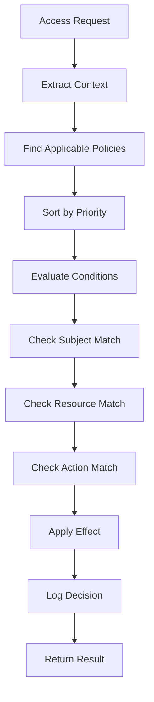

# Policy-Based Access Control (JSON Config) - Design Document

## Overview

This document outlines the design for Issue #19: Policy-Based Access Control (JSON Config), which will implement a flexible, JSON-based policy system for ngdpbase's access control framework.

## Current State Analysis

### ✅ Existing Infrastructure

- __ACLManager__: Core access control with page-level permissions
- __UserManager__: User and role management
- __Config System__: JSON-based configuration management
- __Context-Aware Permissions__: Time-based and maintenance mode support

### 🎯 Enhancement Goals

- __Flexibility__: JSON-based policy definitions
- __Granularity__: Fine-grained permission control
- __Maintainability__: Easy policy management and updates
- __Auditability__: Policy evaluation logging
- __Scalability__: Support for complex organizational structures

## Policy Schema Design

### Core Policy Structure

```json
{
  "policies": [
    {
      "id": "admin-full-access",
      "name": "Administrator Full Access",
      "description": "Full access for system administrators",
      "priority": 100,
      "effect": "allow",
      "subjects": [
        {
          "type": "role",
          "value": "admin"
        }
      ],
      "resources": [
        {
          "type": "page",
          "pattern": "*"
        },
        {
          "type": "attachment",
          "pattern": "*"
        }
      ],
      "actions": ["view", "edit", "delete", "upload", "admin"],
      "conditions": [],
      "metadata": {
        "created": "2025-09-14T12:00:00Z",
        "author": "system",
        "tags": ["admin", "full-access"]
      }
    }
  ]
}
```

### Policy Components

#### 1. Policy Identification

- __id__: Unique identifier (string)
- __name__: Human-readable name
- __description__: Policy purpose and scope
- __priority__: Evaluation order (higher = evaluated first)

#### 2. Policy Effect

- __effect__: "allow" | "deny"
- __Determines final access decision__

#### 3. Subjects (Who)

```json
{
  "subjects": [
    {
      "type": "user",
      "value": "john.doe"
    },
    {
      "type": "role",
      "value": "editor"
    },
    {
      "type": "group",
      "value": "marketing-team"
    },
    {
      "type": "attribute",
      "key": "department",
      "value": "engineering"
    }
  ]
}
```

#### 4. Resources (What)

```json
{
  "resources": [
    {
      "type": "page",
      "pattern": "/docs/*"
    },
    {
      "type": "attachment",
      "pattern": "*.pdf"
    },
    {
      "type": "category",
      "value": "System"
    },
    {
      "type": "tag",
      "value": "confidential"
    }
  ]
}
```

#### 5. Actions (How)

```json
{
  "actions": [
    "view",
    "edit",
    "delete",
    "rename",
    "upload",
    "download",
    "admin",
    "export"
  ]
}
```

#### 6. Conditions (When/Where)

```json
{
  "conditions": [
    {
      "type": "time",
      "schedule": "business-hours"
    },
    {
      "type": "ip-range",
      "ranges": ["192.168.1.0/24", "10.0.0.0/8"]
    },
    {
      "type": "user-attribute",
      "key": "clearance-level",
      "operator": ">=",
      "value": "secret"
    },
    {
      "type": "context",
      "key": "is-emergency",
      "value": true
    }
  ]
}
```

## Policy Engine Architecture

### Core Components

#### 1. PolicyManager

- __Load policies__ from JSON configuration
- __Validate policy syntax__ and structure
- __Cache policies__ for performance
- __Provide policy CRUD operations__

#### 2. PolicyEvaluator

- __Evaluate policies__ against access requests
- __Handle policy priority__ and conflict resolution
- __Support condition evaluation__
- __Generate audit logs__ for policy decisions

#### 3. PolicyValidator

- __Schema validation__ for policy definitions
- __Conflict detection__ between policies
- __Security validation__ to prevent privilege escalation
- __Performance validation__ for policy complexity

### Policy Evaluation Flow



### Integration Points

#### 1. ACLManager Integration

```javascript
// In ACLManager.checkAccess()
const policyResult = await this.policyManager.evaluatePolicies(context);
if (policyResult.hasDecision) {
  return policyResult.decision;
}
// Fall back to existing ACL logic
```

#### 2. Route Middleware

```javascript
app.use('/admin', policyMiddleware('admin-access'));
app.use('/api', policyMiddleware('api-access'));
```

#### 3. Page-Level Permissions

```javascript
// Policy-based page restrictions
const pagePolicies = await policyManager.getPoliciesForResource('page', pageName);
```

## Configuration Structure

### Main Configuration File

```json
{
  "accessControl": {
    "policies": {
      "enabled": true,
      "configFile": "./config/policies.json",
      "defaultEffect": "deny",
      "evaluationMode": "first-applicable",
      "cache": {
        "enabled": true,
        "ttl": 300
      }
    }
  }
}
```

### Policy File Structure

```bash
config/
├── policies.json          # Main policy definitions
├── policy-schemas.json    # JSON schema for validation
└── policy-templates/      # Reusable policy templates
    ├── admin-policies.json
    ├── user-policies.json
    └── department-policies.json
```

## Admin Interface Design

### Policy Management Dashboard

- __Policy List__: View all policies with status and priority
- __Policy Editor__: Create/edit policies with form validation
- __Policy Tester__: Test policies against sample requests
- __Conflict Detector__: Identify policy conflicts and overlaps
- __Audit Viewer__: View policy evaluation history

### Policy Editor Features

- __Visual Policy Builder__: Drag-and-drop policy creation
- __Template Library__: Pre-built policy templates
- __Validation Feedback__: Real-time syntax and logic validation
- __Import/Export__: JSON import/export for backup/sharing

## Security Considerations

### Policy Security

- __Privilege Escalation Prevention__: Validate policy effects don't grant excessive permissions
- __Circular Reference Detection__: Prevent policies that reference themselves
- __Resource Pattern Validation__: Ensure patterns don't expose unintended resources

### Runtime Security

- __Input Validation__: Sanitize all policy inputs
- __Rate Limiting__: Prevent policy evaluation abuse
- __Audit Logging__: Log all policy changes and evaluations
- __Access Control__: Restrict policy management to administrators

## Performance Optimization

### Caching Strategy

- __Policy Cache__: Cache compiled policies in memory
- __Evaluation Cache__: Cache recent evaluation results
- __Resource Pattern Cache__: Cache compiled regex patterns

### Optimization Techniques

- __Lazy Loading__: Load policies on-demand
- __Policy Indexing__: Index policies by subject/resource/action
- __Batch Evaluation__: Evaluate multiple policies efficiently
- __Async Processing__: Non-blocking policy evaluation

## Testing Strategy

### Unit Tests

- __Policy Evaluation__: Test individual policy rules
- __Condition Evaluation__: Test complex conditions
- __Conflict Resolution__: Test policy priority handling
- __Performance__: Test evaluation speed and memory usage

### Integration Tests

- __Full Access Flow__: Test complete request-to-decision flow
- __Policy Changes__: Test policy updates without restart
- __Error Handling__: Test malformed policies and edge cases
- __Load Testing__: Test performance under high load

### Policy Test Scenarios

```json
{
  "testCases": [
    {
      "name": "Admin Full Access",
      "subject": {"user": "admin", "roles": ["admin"]},
      "resource": {"type": "page", "name": "SystemConfig"},
      "action": "edit",
      "expected": "allow"
    },
    {
      "name": "User Restricted Access",
      "subject": {"user": "user1", "roles": ["user"]},
      "resource": {"type": "page", "name": "AdminPage"},
      "action": "view",
      "expected": "deny"
    }
  ]
}
```

## Implementation Roadmap

### Phase 1: Core Policy Engine (Week 1-2)

- [ ] Design and implement policy schema
- [ ] Create PolicyManager class
- [ ] Implement basic policy evaluation
- [ ] Add policy validation

### Phase 2: Advanced Features (Week 3-4)

- [ ] Implement condition evaluation
- [ ] Add policy caching
- [ ] Create admin interface
- [ ] Add conflict detection

### Phase 3: Integration & Testing (Week 5-6)

- [ ] Integrate with ACLManager
- [ ] Add comprehensive tests
- [ ] Performance optimization
- [ ] Documentation and examples

## Success Metrics

- __Functionality__: All policy types working correctly
- __Performance__: <50ms policy evaluation time
- __Security__: Zero privilege escalation vulnerabilities
- __Usability__: Admin can create policies without technical issues
- __Maintainability__: Easy policy updates and troubleshooting

This design provides a solid foundation for flexible, enterprise-grade access control while maintaining ngdpbase's simplicity and performance.
